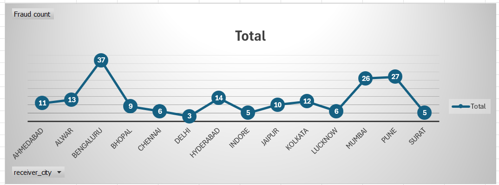
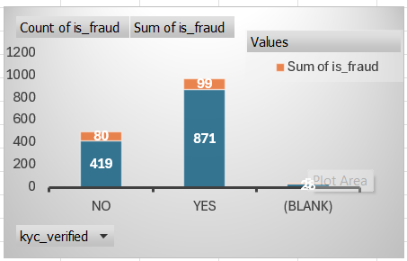
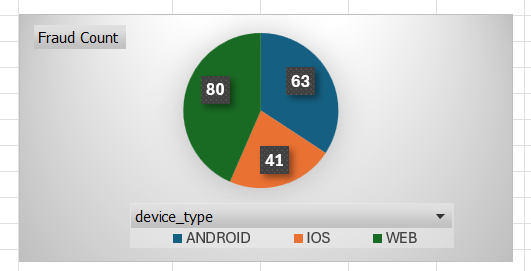

UPI Fraud Detection & Transaction Analytics

Fraud pattern analysis on UPI transaction data using SQL (PostgreSQL) and Excel (Data Model / Power Pivot).

Problem Statement

Digital payment platforms process thousands of transactions daily, and fraud often hides within specific segments (device type, KYC status, time of transaction, geography) rather than showing up in overall volume. This project analyzes a UPI transaction dataset to identify where fraud concentrates and which customer/transaction attributes carry the highest risk, so monitoring efforts can be focused rather than applied uniformly.

Dataset Overview

Three related tables:

Table	Records	Key Fields

Customers	260	customer_id, age, gender, city, KYC verified, device type, account open date

Receivers	150	receiver_id, receiver type (individual/merchant), city, bank

Transactions	1,318	transaction_id, customer_id, receiver_id, amount, date, time, device_type, status, is_fraud, day_type

Note: This is a practice/synthetic dataset used to demonstrate the analysis workflow, not real UPI transaction data.

Tools Used

SQL (PostgreSQL) — schema design, JOINs, GROUP BY, aggregations, CASE WHEN, subqueries

Excel — Data Model / Power Pivot (multi-table relationships), PivotTables, PivotCharts

Approach

Data Cleaning & Feature Creation (Power Query) — Cleaned the raw transaction data in Excel Power Query before analysis: standardized inconsistent text/city/category values, used TRIM to remove extra whitespace causing lookup mismatches, fixed date formatting for time-based analysis, and removed duplicate records. Also created calculated columns not present in the raw data — including age group (bucketed from customer age) and weekday/weekend (derived from transaction date) — to enable segment-level fraud analysis.

Data Validation — Checked referential integrity across tables before analysis. Found 6 transactions referencing customer_ids that don't exist in the Customers table (orphan records) — flagged and excluded from customer-level analysis rather than silently ignored.

SQL Analysis — Designed a 3-table relational schema in PostgreSQL and wrote 10+ queries to quantify fraud rate by device, KYC status, weekday/weekend, receiver city, and receiver type.
Excel Cross-Validation — Connected the same three tables using Excel's Data Model (Power Pivot) — no VLOOKUP required — and rebuilt the core PivotTable analyses (device, city, KYC) to confirm the SQL results independently.

Key Insights

Overall fraud rate: 14% (184 of 1,318 transactions)

KYC status is a strong risk signal — unverified users showed a 19% fraud rate vs. 11% for verified users (~1.7x higher risk) → supports prioritizing KYC completion as a fraud-reduction lever

Weekend transactions are riskier — 19% fraud rate vs. 12% on weekdays → suggests monitoring should scale up around weekends

Web channel carries the highest device risk — 17% fraud rate vs. 15% on Android and 10% on iOS → device-based risk scoring could help triage alerts

Fraud transactions run ~2x higher in value than genuine ones on average → high-value transactions warrant additional verification steps

Top fraud-prone receiver cities identified (Bengaluru, Pune, Mumbai among the highest) for geographic monitoring

SQL and Excel Data Model results were cross-checked against each other and matched, confirming the analysis is reliable

Recommendations

Based on the analysis above, these are the practical, data-backed actions the findings support:

Prioritize KYC completion drives — unverified users show ~1.7x higher fraud risk, so pushing KYC completion (reminders, incentives, restricted limits for unverified accounts) directly reduces exposure.

Scale fraud monitoring around weekends — with a 19% vs. 12% weekday fraud rate, alert thresholds or manual review capacity could be increased specifically for Saturday/Sunday transactions.

Apply stricter checks on web-channel transactions — the web channel's 17% fraud rate (vs. 10% on iOS) suggests device-based risk scoring, with extra verification steps (OTP, step-up authentication) for web transactions.

Flag high-value transactions for additional review — since fraud transactions run ~2x higher in average value than genuine ones, a value-based review trigger would catch a disproportionate share of fraud.

Investigate top fraud-prone receiver cities — concentration in cities like Bengaluru, Pune, and Mumbai suggests targeted monitoring or receiver-side checks in these regions could have outsized impact.

Fix the referential integrity gap — the 6 orphan transactions (valid receiver, no matching customer) point to a data pipeline issue upstream; resolving this would improve both fraud detection accuracy and downstream reporting reliability.

   
   

